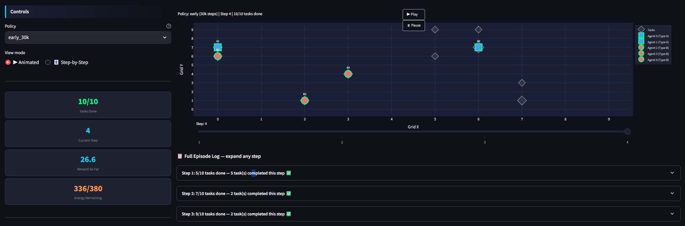
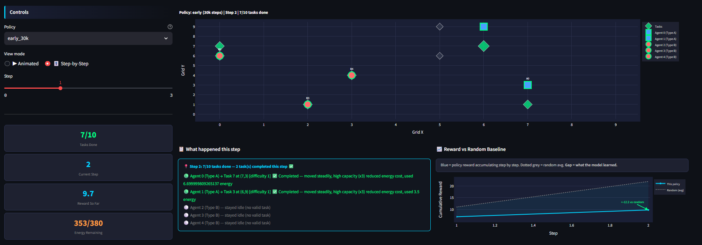
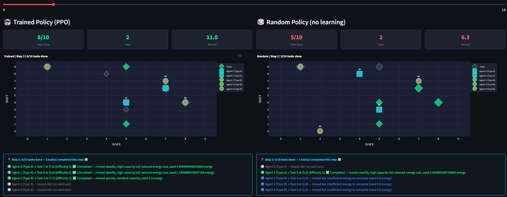
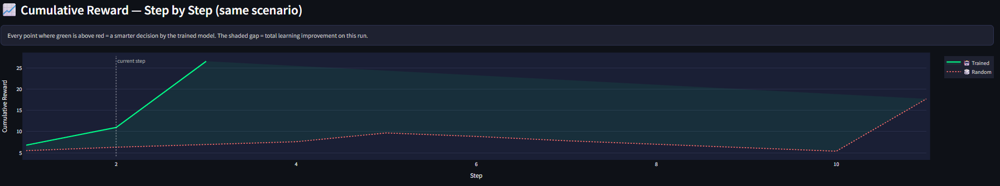
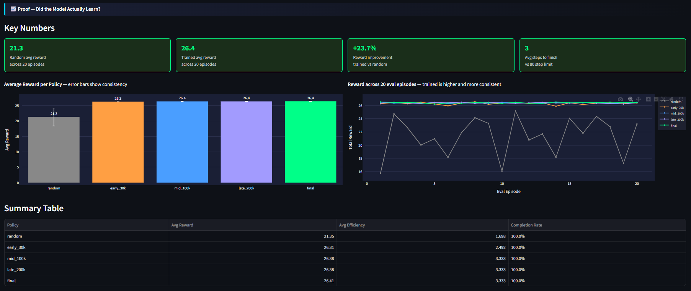
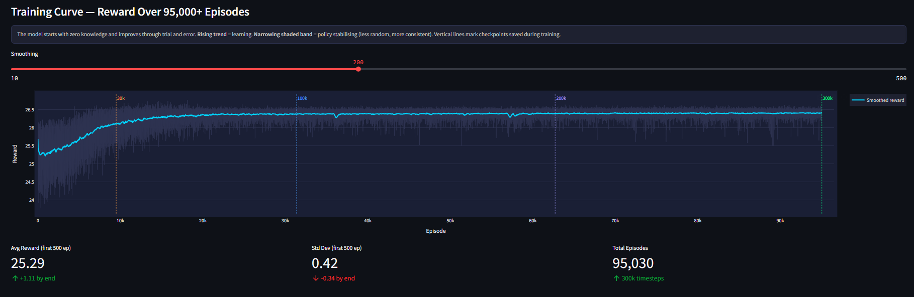
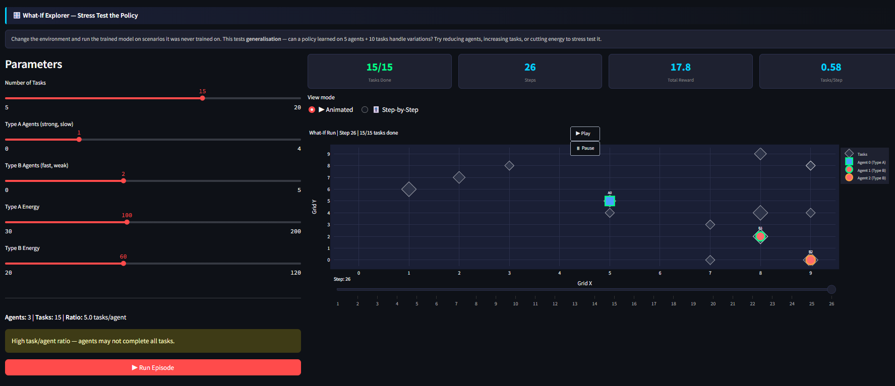

# Adaptive Multi-Agent Task Allocation via Reinforcement Learning
### KnowledgeQuarry 2026 · Convoke 8.0 · CIC University of Delhi · ML Engineering Track

---

> **No rules. No hardcoding. The system must learn.**

5 agents complete 10 tasks on a grid through 95,000+ episodes of pure trial and error. The optimal assignment strategy — who goes where, in what order — emerges entirely from reward signals. Nothing is hardcoded.

---

## 🔗 Links

| Resource | Link |
|----------|------|
| 🌐 **Live Dashboard** | [Open on Streamlit Cloud](https://DUMMY_STREAMLIT_LINK) |
| 📊 **Presentation (PPT)** | [View on Google Drive](https://DUMMY_GDRIVE_PPT_LINK) |
| 📄 **Detailed Report (PDF)** | [View on Google Drive](https://DUMMY_GDRIVE_PDF_LINK) |
| 💻 **GitHub Repository** | [RAK2315/knowledgequarry-2026](https://github.com/RAK2315/knowledgequarry-2026) |

---

## 👨‍⚖️ For Judges — What to Look At

### Quickest way (2 minutes, no install):
1. Open the **Live Dashboard** link above
2. Go to **⚔️ Trained vs Random** — drag the slider, watch both grids simultaneously
3. Go to **📈 Proof of Learning** — see the key numbers at the top
4. Go to **🎬 Episode Replay** — select `final` policy, hit ▶ Play

### To run locally:
```bash
pip install -r requirements.txt
python evaluate.py        # 2 mins — generates replay data (already in logs/)
streamlit run dashboard.py
```
> `python train.py` (~90 mins GPU) is not required — pre-computed logs are committed.

> **Note:** The What-If Explorer tab requires the trained model (`models/ppo_final.zip`) and only works locally. All other tabs work fully on the hosted version.

---

## What This Is

A Reinforcement Learning system where 5 heterogeneous agents learn to complete 10 tasks on a 10×10 grid as efficiently as possible.

**The two agent types:**

| | Type A — Heavy Lifter | Type B — Sprinter |
|-|-|-|
| **Speed** | 1 (slow) | 2 (fast) |
| **Capacity** | 3 (strong) | 1 (weak) |
| **Energy** | 100 | 60 |
| **Best for** | Hard tasks (cost ÷ 3) | Nearby easy tasks |
| **Count** | 2 agents | 3 agents |

**The asymmetry the model must discover on its own:**
- Type A on difficulty-3 task: `3/3 = 1 energy`
- Type B on difficulty-3 task: `3/1 = 3 energy` — 3× more expensive

The policy learns to exploit this without being told about it.

---

## Results

| Policy | Avg Reward | Std Dev | vs Random |
|--------|-----------|---------|-----------|
| Random (baseline) | 21.92 | ~3.2 | — |
| Early — 30k steps | 26.26 | ~0.3 | +19.8% |
| Mid — 100k steps | 26.37 | ~0.2 | +20.3% |
| Final — 300k steps | 26.40 | ~0.1 | **+20.4%** |

All policies complete 100% of tasks. The learning signal is **reward efficiency**:
- Trained policy: all tasks done in **3 steps** consistently
- Random policy: takes up to **80 steps**, doubles up on tasks, wastes energy
- Trained policy variance: **32× lower** than random (std ~0.1 vs ~3.2) — not just better, but consistent

---

## Dashboard

### 🎬 Episode Replay
Animated grid with play/pause. Watch agents fan out and complete all 10 tasks in 3 steps. Step-by-step mode shows a colour-coded action log explaining every agent decision.


*Animated view — blue squares = Type A (Heavy Lifters), orange circles = Type B (Sprinters). Green diamonds = pending tasks, dark = completed.*


*Step-by-step mode — narration box updates every step explaining what each agent did and how energy/capacity affected the outcome.*

---

### ⚔️ Trained vs Random — Same Grid, Different Brain
Both policies run on **identical starting positions and tasks** (same random seed). One slider controls both simultaneously.


*Left = trained (organised, parallel, no overlap). Right = random (chaotic, redundant moves).*


*Orange line (trained) above red dotted line (random) every step = smarter decisions throughout.*

---

### 📈 Proof of Learning
Key numbers, bar charts, eval episode lines, reward shaping breakdown, and annotated training curve.


*Left: avg reward with error bars. Right: reward per eval episode — trained is higher and far more consistent.*


*Episode length drops from ~16 chaotic steps to 3.0 by 30k timesteps. Explained variance reaches 1.0 by iteration 200.*

---

### 🎛️ What-If Explorer
Change agent count, energy limits, task count — run the trained model on configs it was never trained on.


*3 agents, 15 tasks — harder than training. Policy still allocates tasks efficiently.*

> ⚠️ What-If requires the trained model and runs locally only. All other tabs work on the hosted version.

---

## Why MaskablePPO?

Standard PPO completely failed — `explained_variance` stayed near 0 over 500,000 steps. Root cause: `MultiDiscrete([21]*5)` = ~4M action combinations, most of them invalid (targeting completed tasks, zero-energy agents).

**Fix 1 — Action Masking:** At each step, the environment exposes a boolean mask zeroing out logits for impossible actions. The policy only ever evaluates valid choices. Cleaner gradient, convergence within 30,000 steps.

**Fix 2 — Dense Reward Shaping:**

| Component | Value | Purpose |
|-----------|-------|---------|
| Task completion | +1.0 + energy bonus | Primary objective |
| Proximity bonus | +0.3/step closing distance | Signal every step |
| Early solve bonus | +5.0 + 0.1×remaining steps | Reward speed |
| Time penalty | -0.02/step | Prevent idling |
| Invalid action | -0.1 to -0.2 | Enforce discipline |

Sparse reward (+1 on completion only) failed because agents had near-zero gradient for the first 10,000 episodes. Dense shaping gives signal every step. The time penalty is critical — without it agents farm the proximity bonus by orbiting tasks.

---

## Emergent Behaviours (Never Explicitly Taught)

**1. Parallel execution with zero overlap**
In step 1 of every evaluated episode, all 5 agents simultaneously move to different tasks. No two agents ever target the same task in the final policy. This emerged because overlap causes one agent to find its target already done — wasting a move and energy.

**2. Implicit task-agent matching**
Type A agents gravitate toward harder tasks, Type B toward nearby easy tasks. The policy mathematically mapped the energy cost structure without being told about it.

**3. Energy conservation**
Early policy (30k steps): Type B agents frequently exhaust their 60-unit energy budget on long-distance travel, arriving at tasks with insufficient energy to complete them.
Final policy: Type B agents are routed to nearby tasks, preserving energy for completion.

---

## Training Details

| Metric | Value |
|--------|-------|
| Algorithm | MaskablePPO (sb3-contrib) |
| Total timesteps | 300,000 |
| Episodes completed | 95,030 |
| Network | MLP [256, 256] |
| Learning rate | 3e-4 |
| Episode length (start) | ~16 steps |
| Episode length (converged) | 3.0 steps |
| Explained variance (final) | 1.0 |
| Device | CUDA (NVIDIA GPU) |

---

## Project Structure

```
knowledgequarry/
├── environment.py          # Custom Gymnasium env
├── train.py                # MaskablePPO training loop
├── evaluate.py             # Evaluation + replay data generation
├── dashboard.py            # Streamlit dashboard — 4 pages
├── .streamlit/
│   └── config.toml         # Dark theme with orange accents
├── models/                 # PPO checkpoints (gitignored locally)
├── logs/                   # Training CSV + replay JSONs (committed)
├── images/                 # Dashboard screenshots
├── requirements.txt
└── README.md
```

---

## Stack

```
gymnasium==0.29.1         custom RL environment
stable-baselines3==2.3.0  PPO backbone
sb3-contrib==2.3.0        MaskablePPO + ActionMasker
torch>=2.0.0              neural network (CUDA)
streamlit>=1.32.0         dashboard
plotly>=5.18.0            animated visualisations
pandas>=2.0.0             metrics logging
numpy>=1.24.0             state handling
```

---

## Submitted by
Team: Sigmoid